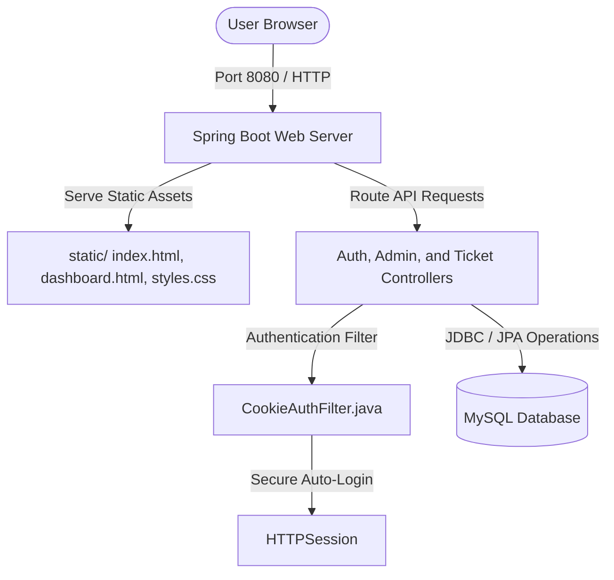

# Payanam Bus Tracking & Ticket Booking 🚌

Payanam is a modern, premium Bus Tracking and Ticket Booking system built with a unified, **single-port hybrid architecture**. It combines a high-performance Spring Boot API backend with a responsive, stunning web dashboard served directly from a single runtime.

---

## 🌟 Key Features

The platform supports a robust role-based access control (RBAC) system with three distinct user roles:

### 1. Passenger 🧑‍✈️
*   **Persistent Autologin:** Check **"Keep me signed in for 24h"** at login to stay authenticated across browser sessions via secure, automated cookies.
*   **OLED Dark Theme:** Dynamic toggle between Light and a beautiful, high-contrast, battery-saving OLED Black theme, saved in a persistent 1-year cookie to prevent visual flashing.
*   **Fare Calculator:** Fair and transparent stop-based pricing (minimum Rs 5, maximum Rs 25, Rs 1.50 per stop, rounded to the nearest rupee) calculated dynamically on search, eliminating complex spatial distance variables.
*   **Ticket Booking & Vault:** Book digital tickets instantly, with tickets ordered by most recent purchase on top. Dynamically generated secure QR codes contain encrypted SHA-256 validation signatures alongside high-fidelity SVG barcodes (`JsBarcode CODE128`) stored for auditing.
*   **Route Tracking:** Monitor stop-by-stop progression of any active bus route in real-time, with an instant page-free "Refresh" tracker.

### 2. Ticket Collector 🎫
*   **Active Shift Assignment:** Start a journey by assigning yourself to a specific bus route, automatically terminating any stale active shifts.
*   **Journey Lock:** Collectors are safely locked into their selected route until reaching the final stop (to ensure tracking integrity) or ending their shift.
*   **Automated Stop Updates:** Seamless progression tool that automatically prompts the collector to advance to the next sequential stop without manual entry.
*   **Ticket Validator:** Securely validate passenger digital tickets using a native browser camera scanner (`Html5Qrcode`) or manual verification box, transparently validating both numeric Ticket IDs and alphanumeric Booking References.
*   **Shift Performance Summary:** Track the total tickets verified and duration inside a dedicated live collector dashboard.

### 3. System Administrator 👑
*   **Live Dashboard Overview:** Real-time platform metrics deck showing total users, active fleet, tickets sold, overall platform revenue, **day-by-day (daily) income**, and **monthly income**.
*   **Fleet Management:** Add new buses to the tracking registry or decommission old ones instantly.
*   **Route Stop Sequences:** Fully configure, customize, and save the stop-by-stop sequence for any bus route.
*   **Staff Registry:** Manage and register new official Ticket Collectors into the system.

---

## 🏗 System Architecture

Payanam has been refactored from a multi-port environment into a streamlined **Single-Port Monolithic API & Static Server**:



*   **Unified Delivery:** Static frontend resources (`HTML`, `CSS`, `JS`) are located in `src/main/resources/static` and served directly by Spring Boot on port `8080`.
*   **Cookie Security:** Implements a servlet-level `CookieAuthFilter` that automatically reads the secure, HttpOnly `payanam_user` cookie to restore expired user sessions seamlessly.
*   **Geospatial Simplification:** Removed heavy coordinate lookup, live map tracking, and haversine calculations. Route progression is tracked exclusively by discrete stop indices, delivering lightweight database loads and ultra-fast mobile loading speeds.

---

## 💻 Tech Stack

*   **Backend:** Java 17 | Spring Boot 3.x | Spring Data JPA (Hibernate)
*   **Database:** MySQL (Local or cloud-hosted)
*   **Security:** BCrypt Hashing | HttpOnly Remember-Me Session Cookies
*   **Frontend:** HTML5 | Vanilla CSS (OLED Dark Mode, Custom properties) | ES6 JavaScript

---

## 🚀 Setup and Installation

### 1. Database Configuration
By default, the application is pre-configured with a remote cloud **Aiven MySQL** instance, making it fully runnable out-of-the-box!

If you prefer to run against a local database, open `src/main/resources/application.properties` and swap the comment lines:

```properties
# Local Fallback
spring.datasource.url=URL
spring.datasource.username=USERNAME
spring.datasource.password=YOUR_PASSWORD
```

> [!NOTE]
> The database schema, constraints, and initial seeding are fully automated! On the first boot, the application builds all necessary tables and inserts the default admin credentials.

### 2. Running Locally
Run the application in a single terminal from the root workspace using the Maven wrapper:

```bash
# Clean project and boot the unified server
./mvnw spring-boot:run
```

Once started, open your browser and navigate to:
👉 **`http://localhost:8080`**

---

## 🔑 Seeded Administrator Account

Log in immediately using the pre-seeded admin profile:
*   **Phone Number:** `7604859072`
*   **Password:** `Admin@123`

---

## 🐳 Containerization & Cloud Deployment

### Docker Setup
A high-performance, multi-stage `Dockerfile` is provided for containerizing the application:

```bash
# Build the container
docker build -t payanam-app .

# Run the container mapping to port 8080
docker run -p 8080:8080 --env SPRING_DATASOURCE_URL=... payanam-app
```

### Render Deployment
This project is configured as a native cloud-blueprint service with a complete `render.yaml` template. Simply connect your GitHub repository to Render, configure your database environment variables, and let the build deploy automatically.
